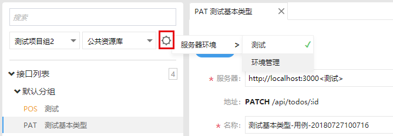
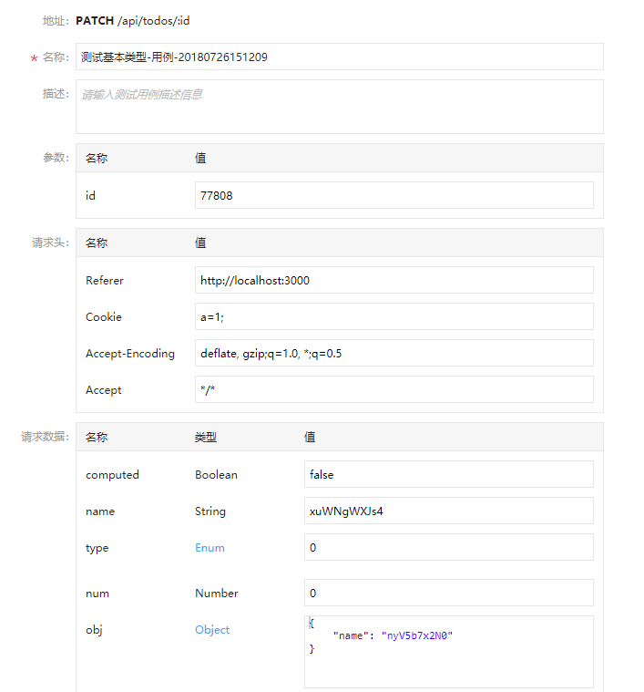
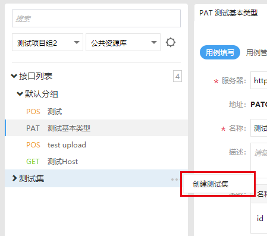
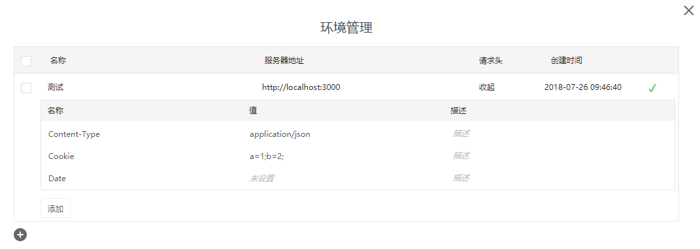

NEI 目前已经发布了接口测试的功能，方便开发人员在本地测试接口

## 接口测试入口
在左侧导航栏进入接口测试    

### 测试单个接口
选择好项目组和项目，在下方选择待测的接口，进入用例配置界面    
    
在用例配置界面可以配置项目的服务器环境。    
也可以在接口列表上方选择项目的服务器环境    
    
在下方填入测试用例的请求数据    
    
其中，路径参数，请求数据NEI已自动随机生成相应的数据，你可以根据自己的需要进行修改，注意生成的Mock数据不是万能的，一些嵌套数据类型，你可能需要再进行相应修改    
    
发送规则即请求发送前对请求进行一系列处理的规则    
还可以在下方设置期望响应数据。    
填完后，点击开始测试即可开始测试

### 重新测试接口的用例
所有测试过的用例都会保存，你可以在接口的用例管理页面查看到他们，你可以选择一些用例进行重新测试或者进入单个用例进行单独的重测，或者在新建单个用例并修改，再重新测试，这在配置大部分请求数据相同相似的用例的时候会省力。

### 批量测试接口
在左侧接口列表可以看到下方有一个测试集，测试集是用来批量测试接口的
    
新建一个测试集进入，选择增加接口来增加需要批量测试的接口。测试集测试接口会测试待测接口集的所用用例。
选择测试全部即测全部接口的全部用例，或者选择部分接口来进行测试

## 配置项目的服务器环境
你可以配置项目的服务器环境，包括服务器地址，请求头。注意，所有测试用例进行本地测试时，会使用当前的项目的服务器环境    
你可以在用例配置界面进行项目服务器环境的选择和配置。
    
你可以增加项目的请求头

## FAQ
Q: 如何模拟登陆？    
A: 有两种方法，一是配置项目的服务器环境，在服务器环境的请求头的Cookie部分增加权限信息，由于webRequest的限制，Authoration 头暂不支持，你可以使用自定义的头进行权限鉴定。
二是在测试用例配置界面配置测试用例的请求头Cookie，注意，测试用例的请求头的优先级比服务器环境请求头的优先级高，测试时会覆盖服务器环境同名请求头。    
Q: 多用户环境下如何方便切换测试？    
A: 多用户环境下，你可以先配置项目环境，并复制项目环境配置其他用户的服务器环境，切换测试即切换环境即可。    