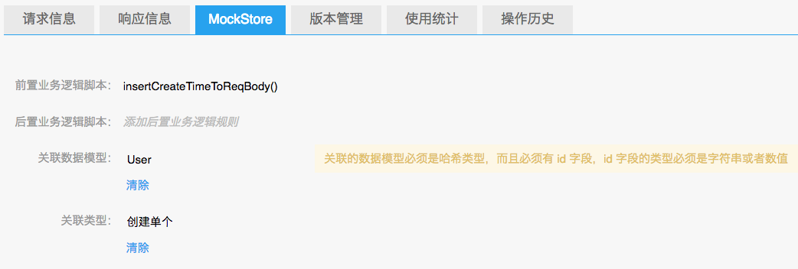
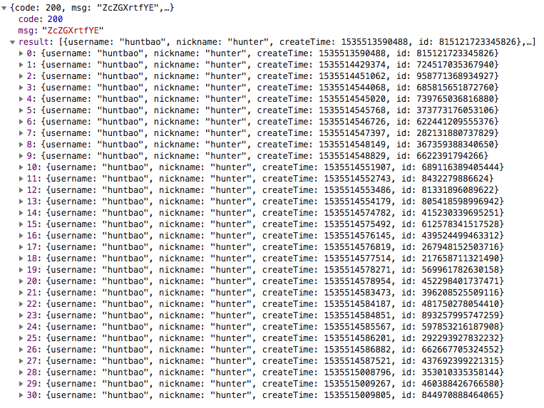
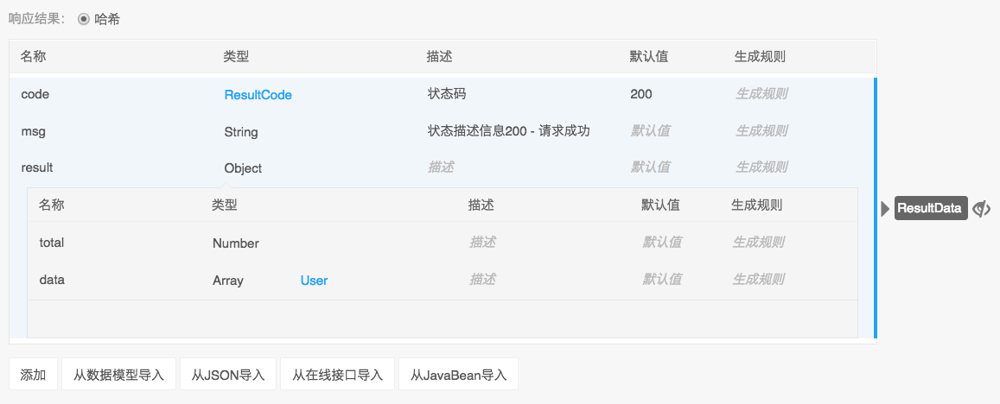
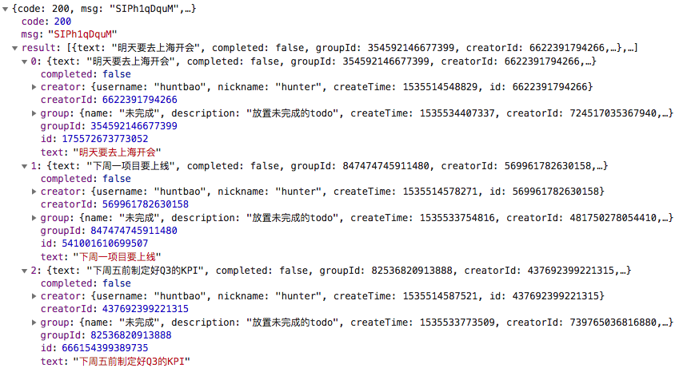

# MockStore Connect 示例代码

- [创建单个用户](#创建单个用户)
- [加载所有用户](#加载所有用户)
- [加载所有用户-支持分页](#加载所有用户-支持分页)
- [创建单个分组](#创建单个分组)
- [按照数组数据批量创建Todo](#按照数组数据批量创建todo)
- [加载多个Todo](#加载多个todo)
- [修改单个Todo](#修改单个todo)
- [修改所有Todo](#修改所有todo)
- [修改多个Todo](#修改多个todo)
- [删除单个Todo](#删除单个todo)
- [删除多个Todo](#删除多个todo)
- [删除所有Todo](#删除所有todo)

本文以 NEI 的官方 Demo 项目 [Todo](https://nei.netease.com/project?pid=18754) 为例，演示如何操作 Mock 数据。

项目中有 3 个数据模型：`User`、`Group`、`Todo`：

- `User`，用户模型
```json
{
    "id": "{ Number }",
    "username": "{ String }",
    "nickname": "{ String }",
    "createTime": "{ Number }"
}
```
- `Group`，分组模型
```json
{
    "id": "{ Number }",
    "name": "{ String }",
    "description": "{ String }",
    "createTime": "{ Number }",
    "creatorId": "{ Number }",
    "creator": "{ User }",
}
```
- `Todo`，todo 项模型，可以对它们进行分组管理
```json
{
    "id": "{ Number }",
    "text": "{ String }",
    "completed": "{ Boolean }",
    "groupId": "{ Number }",
    "group": "{ Group }",
    "creatorId": "{ Number }",
    "creator": "{ User }",
    "createTime": "{ Number }"
}
```

没有用户，其他流程就走不通，所以我们先来创建用户。

#### 创建单个用户

在实际项目中，创建用户其实就是用户注册的过程，这里我们就直接调用接口来创建了。联想一下实际的注册场景，用户的 `id` 和 `createTime`，都不是前端发送的数据，`id` 可能是程序随机生成的唯一值，或者是数据库自动生成的唯一值。同样，`createTime` 可以是程序代码生成也可以是插入数据库的时候自动生成。

MockStore 是通用的解决方案，除了对数据模型的 `id` 字段有强制的使用要求和特殊处理外，它不会认为 `createTime` 是数据模型的创建时间，因为这只是一个名字，不同的人可以起不一样的名字，让 MockStore 来处理是不可能的。

所以，`createTime` 不能由前端发送，也不能由 MockStore 自动处理，但对于 `User` 模型来说，必须有 `createTime` 属性，否则我们就 Mock 不了实际的工作场景。

MockStore 已经考虑到了这种场景，就是使用前置业务逻辑脚本的功能，在将数据保存到数据库之前对数据进行修改，下面我们来看一下怎么实现。

在 [User-新建](https://nei.netease.com/interface/detail/mockstore/?pid=18754&id=41126) 的 MockStore 设置页面，按照如下设置：



规则函数 `insertCreateTimeToReqBody` 的内容如下：

```js
function insertCreateTimeToReqBody() {
    const options = arguments[0];
    const reqBody = options.req.body;
    reqBody.createTime = Date.now();
    return {
        data: reqBody
    }
}
```

下面是创建单个用户的请求：

```js
const host = 'https://nei.netease.com';
const projectKey = 'b209329e46daae533ac0649051abcba9';
const url = `${host}/api/apimock/${projectKey}/api/users/`;
const sendData = {
  "username": "huntbao",
  "nickname": "hunter"
};

function create() {
  fetch(url, {
    method: 'POST',
    body: JSON.stringify(sendData),
    headers: {
      'Content-Type': 'application/json'
    }
  }).then((res) => {
    return res.json();
  }).then((data) => {
    console.log(JSON.stringify(data));
  });
}

create();
```

假设我们已经将上述代码运行过多次，不出什么差错的话，就会相应地创建多个用户了，并且每个用户分配了唯一的 id，下面我们通过请求来加载所有用户列表。

#### 加载所有用户

在 [User-获取所有用户](https://nei.netease.com/interface/detail/mockstore/?pid=18754&id=130037) 的 MockStore 设置页面，按照如下设置：


下面是加载所有用户的代码：

```js
const host = 'https://nei.netease.com';
const projectKey = 'b209329e46daae533ac0649051abcba9';
const url = `${host}/api/apimock/${projectKey}/api/users/`;

function loadAll() {
  fetch(url, {
    method: 'GET',
    headers: {
      'Content-Type': 'application/json'
    }
  }).then((res) => {
    return res.json();
  }).then((data) => {
    console.log(JSON.stringify(data));
  });
}

loadAll();
```

这是我在本地某次运行的结果：



加载所有列表的场景毕竟较为少见，一般都会采用分页技术展示列表，下面我们来看一下 MockStore 是如何支持分页的。


#### 加载所有用户-支持分页

要将数据分页，请求中还要多 3 个参数信息：
- `offset`：分页的开始索引
- `limit`：每页的数据数量
- `total`：是否返回总数

在 [User-获取所有用户-支持分页](https://nei.netease.com/interface/detail/?pid=18754&id=130038) 的 请求信息 设置页面，添加上面三个参数：


因为 MockStore 是通用的解决方案，不能强制分页的时候必须让用户使用 `offset`、`limit`、`total` 这样的参数名。

对于客户端工程师来说，不用管 MockStore 后端是如何分页的，只要最终返回的数据满足要求即可。所以可以在 MockStore 返回数据前进行一层处理，也就是借助于后置业务逻辑脚本实现分页的需求。

下面是 [User-获取所有用户-支持分页](https://nei.netease.com/interface/detail/res/?pid=18754&id=130038) 的 响应结果 定义：



在 [User-获取所有用户-支持分页](https://nei.netease.com/interface/detail/mockstore/?pid=18754&id=130038) 的 MockStore 设置页面，按照如下设置：


规则函数 `paging` 的内容如下：

```js
function paging() {
  const options = arguments[0];
  const resData = options.resData;
  const query = options.req.query;

  if (query.total === 'true') {
    resData.result.total = resData.result.data.length;
  } else {
    delete resData.result.total;
  }
  resData.result.data = resData.result.data.splice(query.offset || 0, query.limit || 10);
}
```

注意，后置业务逻辑脚本 `paging` 并没有返回值，它是直接修改了 options.resData，这也是可以的。

下面是请求代码：

```js
const host = 'https://nei.netease.com';
const projectKey = 'b209329e46daae533ac0649051abcba9';
const url = `${host}/api/apimock/${projectKey}/api/users?paging&total=true&offset=8&limit=8`;

function loadOfPaging() {
  fetch(url, {
    method: 'GET',
    headers: {
      'Content-Type': 'application/json'
    }
  }).then((res) => {
    return res.json();
  }).then((data) => {
    console.log(JSON.stringify(data));
  });
}

loadOfPaging();
```

下面是某次请求的返回结果：


有了用户后，我们就可以创建 Todo 了。所有 todo 项都属于一个分组，在创建的时候就会自动选中系统创建的默认分组，系统在初始化的时候，会创建一个默认的分组。当然，用户也可以创建自定义的分组。下面我们就来看一下如何创建分组。

#### 创建单个分组

创建分组的过程，和创建用户是类似的。不过，有点不同的是，Group 数据模型有一个 `creator` 字段，它是指这个 Group 的创建者。在实际产品中，Group 的创建者就是当前的登录用户，创建 Group 的请求，它发送的数据中并没有 `creator` 信息。和 `createTime` 一样，也需要使用前置业务脚本修改请求发送的数据。在[MockStore 实现文档](./mockstore实现细节文档.md)中的 `前置业务逻辑脚本`小节中已经说明，注入给它的参数中有一个 `allModels`，它是接口所在的项目中的所有数据模型的 Mock 数据列表，所以会包含之前我们已经创建的 `User` 列表，出于 Mock 的目的，我们可以指定特定的 User 对象为 Group 的创建者，当然也可以随机挑选一个 User。

再考虑到实际场景，一般来说，数据库中有专门存储 User 的表，也有专门存储 Group 的表，Group 表中不会直接保存 creator，只要保存 creatorId 就可以，这是关系型数据库设计的基本知识。所以，我们也来模拟这种场景，保存的时候，我们只设置 creatorId，在返回的时候再通过后置业务逻辑脚本设置 creator 字段信息。

下面是[Group-新建](https://nei.netease.com/interface/detail/mockstore/?pid=18754&id=130033)的 MockStore 设置：


前置业务逻辑脚本 `insertCreateInfoToReqBody` 的内容为：

```js
function insertCreateInfoToReqBody() {
  const options = arguments[0];
  const reqBody = options.req.body;
  reqBody.createTime = Date.now();
  const users = options.allModels.user;
  // 随机取一个用户，设置 creatorId，并不是 creator
  reqBody.creatorId = users[parseInt(Math.random() * users.length)].id;
}
```

后置业务逻辑脚本 `insertCreatorToResData` 的内容为：

```js
function insertCreatorToResData() {
  const options = arguments[0];
  const resData = options.resData;
  resData.result.creator = options.allModels.user.find(user => {
    return user.id === resData.result.creatorId;
  });
}
```

创建 Group 的代码为：

```js
const host = 'https://nei.netease.com';
const projectKey = 'b209329e46daae533ac0649051abcba9';
const url = `${host}/api/apimock/${projectKey}/api/groups/`;
const sendData = {
  "name": "未完成",
  "description": "放置未完成的todo"
}

function create() {
  fetch(url, {
    method: 'POST',
    body: JSON.stringify(sendData),
    headers: {
      'Content-Type': 'application/json'
    }
  }).then((res) => {
    return res.json();
  }).then((data) => {
    console.log(JSON.stringify(data));
  });
}

create();
```

我在本地的某次运行结果：


用户和分组都有了，下面我们来看一下如何操作 Todo。

创建单个 Todo 的过程和创建单个 Group 类型，就不再演示了，首先我们来看如何批量创建 Todo。


#### 按照数组数据批量创建Todo

前置和后置业务逻辑脚本，处理方式和创建 Group 类似，代码就不演示了，需要注意的是此时处理的是数组数据。

下面是请求代码：

```js
const host = 'https://nei.netease.com';
const projectKey = 'b209329e46daae533ac0649051abcba9';
const url = `${host}/api/apimock/${projectKey}/api/todos?bat`;
const sendData = {
  items: [
    {
      "text": "明天要去上海开会",
      "completed": false,
    },
    {
      "text": "下周一项目要上线",
      "completed": false,
    },
    {
      "text": "下周五前制定好Q3的KPI",
      "completed": false,
    }
  ]
};

function create() {
  fetch(url, {
    method: 'POST',
    body: JSON.stringify(sendData),
    headers: {
      'Content-Type': 'application/json'
    }
  }).then((res) => {
    return res.json();
  }).then((data) => {
    console.log(JSON.stringify(data));
  });
}

create();
```

下面是我在本地某次的运行结果：




#### 加载多个Todo

下面是加载多个 Todo 的示例代码：

```js
const host = 'https://nei.netease.com';
const projectKey = 'b209329e46daae533ac0649051abcba9';
const url = `${host}/api/apimock/${projectKey}/api/todos?ids=710396385783026,210806102909737`;

function loadList() {
  fetch(url, {
    method: 'GET',
    headers: {
      'Content-Type': 'application/json'
    }
  }).then((res) => {
    return res.json();
  }).then((data) => {
    console.log(JSON.stringify(data));
  });
}

loadList();
```


#### 修改单个Todo

下面是修改 id 为 `574551538754787` 的 Todo 的示例代码：

```js
const host = 'https://nei.netease.com';
const projectKey = 'b209329e46daae533ac0649051abcba9';
const url = `${host}/api/apimock/${projectKey}/api/todos/574551538754787`;
const sendData = {
  completed: true
};

function update() {
  fetch(url, {
    method: 'PATCH',
    body: JSON.stringify(sendData),
    headers: {
      'Content-Type': 'application/json'
    }
  }).then((res) => {
    return res.json();
  }).then((data) => {
    console.log(JSON.stringify(data));
  });
}

update();
```

#### 修改所有Todo

下面是将所有 Todo 的 completed 修改为 true 的示例代码：

```js
const host = 'https://nei.netease.com';
const projectKey = 'b209329e46daae533ac0649051abcba9';
const url = `${host}/api/apimock/${projectKey}/api/todos?all`;
const sendData = {
  completed: true
};

function updateAll() {
  fetch(url, {
    method: 'PATCH',
    body: JSON.stringify(sendData),
    headers: {
      'Content-Type': 'application/json'
    }
  }).then((res) => {
    return res.json();
  }).then((data) => {
    console.log(JSON.stringify(data));
  });
}

updateAll();
```


#### 修改多个Todo

下面是修改多个 Todo 的示例代码：

```js
const host = 'https://nei.netease.com';
const projectKey = 'b209329e46daae533ac0649051abcba9';
const url = `${host}/api/apimock/${projectKey}/api/todos?bat`;
const sendData = {
  items: [
    {
      id: 528124469732725,
      completed: false
    },
    {
      id: 489464342120225,
      completed: false,
      text: '下周二项目要上线'
    }
  ]
};

function updateList() {
  fetch(url, {
    method: 'PATCH',
    body: JSON.stringify(sendData),
    headers: {
      'Content-Type': 'application/json'
    }
  }).then((res) => {
    return res.json();
  }).then((data) => {
    console.log(JSON.stringify(data));
  });
}

updateList();
```


#### 删除单个Todo

下面是删除单个 Todo 的示例代码：

```js
const host = 'https://nei.netease.com';
const projectKey = 'b209329e46daae533ac0649051abcba9';
const url = `${host}/api/apimock/${projectKey}/api/todos/489464342120225`;

function remove() {
  fetch(url, {
    method: 'DELETE',
    headers: {
      'Content-Type': 'application/json'
    }
  }).then((res) => {
    return res.json();
  }).then((data) => {
    console.log(JSON.stringify(data));
  });
}

remove();
```

#### 删除多个Todo

下面是删除多个 Todo 的示例代码：

```js
const host = 'https://nei.netease.com';
const projectKey = 'b209329e46daae533ac0649051abcba9';
const url = `${host}/api/apimock/${projectKey}/api/todos?ids=249500380716093,111460769248514`;

function removeList() {
  fetch(url, {
    method: 'DELETE',
    headers: {
      'Content-Type': 'application/json'
    }
  }).then((res) => {
    return res.json();
  }).then((data) => {
    console.log(JSON.stringify(data));
  });
}

removeList();
```


#### 删除所有Todo

下面是删除所有 Todo 的示例代码：

```js
const host = 'https://nei.netease.com';
const projectKey = 'b209329e46daae533ac0649051abcba9';
const url = `${host}/api/apimock/${projectKey}/api/todos?all`;

function removeAll() {
  fetch(url, {
    method: 'DELETE',
    headers: {
      'Content-Type': 'application/json'
    }
  }).then((res) => {
    return res.json();
  }).then((data) => {
    console.log(JSON.stringify(data));
  });
}

removeAll();
```

以上就是所有 11 种情况的代码示例，欢迎大家试用！